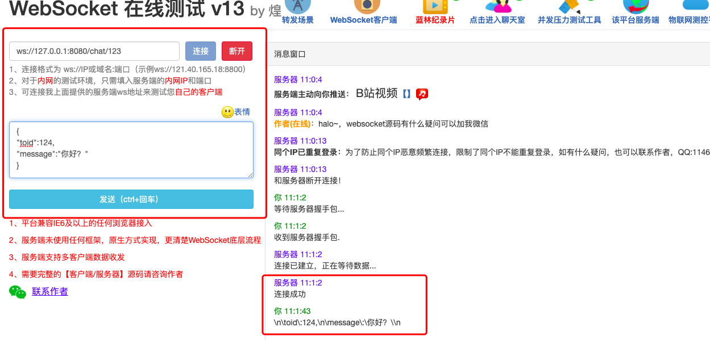
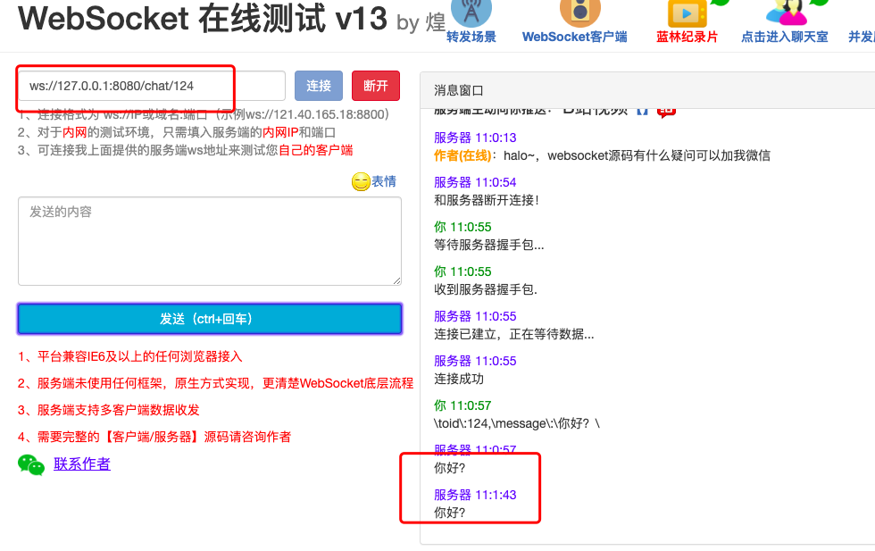
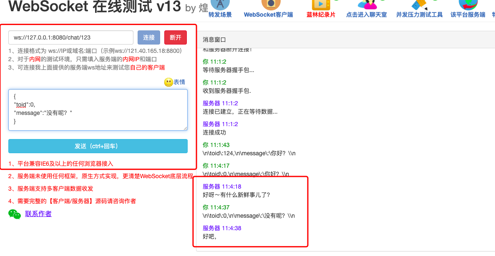

### 聊天室


>技术要点

* websocket技术


说起聊天室肯定首选技术是**WebSocket**，**WebSocket**是一种在单个[TCP](https://baike.baidu.com/item/TCP)连接上进行[全双工](https://baike.baidu.com/item/全双工)通信的协议，使用它比使用长连接和短连接更加符合业务需求

> 个人总结:**长短连接和轮询都是服务器端被动，只能客户端先发起请求的方式，提现了http协议的被动型；而websocket服务器端可以发送多次消息给客户端**


> 效果图

##### 聊天信息格式

```json
{
"toid":124,
"message":"你好？"
}
```


##### 交互式聊天

> 发送者



> 接收者




##### 和机器人聊天

> Toid 为 0 时，发送给机器人




我们这里是采用SpringBoot上直接构建的原生的websocket，其实真实高并发高流量的业务场景肯定是首选使用netty框架实现。


```java
@ServerEndpoint("/chat/{userId}")
@Component
public class WebChatServer {

    static Logger log= LoggerFactory.getLogger(WebChatServer.class);
    private static int onlineCount = 0;
    private static ConcurrentHashMap<Integer,WebChatServer> webSocketMap = new ConcurrentHashMap<>();
    private Session session;
    private int userId= 0;


    static ChatRobot chatRobot;

    public WebChatServer(){

    }


    @Autowired
    public WebChatServer(ChatRobot chatRobot){
        this.chatRobot = chatRobot;
    }


    /**
     * 连接建立成功调用的方法*/
    @OnOpen
    public void onOpen(Session session,@PathParam("userId") int userId) {
        this.session = session;
        webSocketMap.put(userId,this);     //加入set中
        addOnlineCount();           //在线数加1
        log.info("有新用户开始监听:"+userId+",当前在线人数为" + getOnlineCount());
        this.userId=userId;
        try {
            sendMessage("连接成功");
        } catch (IOException e) {
            log.error("websocket IO异常");
        }
    }

    /**
     * 连接关闭调用的方法
     */
    @OnClose
    public void onClose() {
        webSocketMap.remove(this);  //从set中删除
        subOnlineCount();           //在线数减1
        log.info("有一连接关闭！当前在线人数为" + getOnlineCount());
    }

    /**
     * 收到客户端消息后调用的方法
     *
     * @param message 客户端发送过来的消息*/
    @OnMessage
    public void onMessage(String message, Session session) throws IOException {
        log.info("收到来自用户"+userId+"的信息:"+message);
        try{
            //解析message
            JSONObject jsonObject = JSONObject.parseObject(message);
            int toid = (int)jsonObject.get("toid");
            if (toid == 0){
                WebChatServer webSocketServer = webSocketMap.get(toid);
                String messageContent = jsonObject.get("message").toString();
                String chatContent = chatRobot.getChatContent(messageContent);
                sendMessage(chatContent);
                log.info("成功回复信息给用户"+userId+":"+chatContent);
            }else{
                WebChatServer webSocketServer = webSocketMap.get(toid);
                if (webSocketServer != null){
                    String messageContent = jsonObject.get("message").toString();
                    webSocketServer.sendMessage(messageContent);
                    log.info("成功发送信息给用户"+toid+":"+messageContent);
                }
            }
        }catch (Exception e){
            System.out.println(e.toString());
            sendMessage("发送信息格式错误，请您检验后重发");
        }

    }

    /**
     *
     * @param session
     * @param error
     */
    @OnError
    public void onError(Session session, Throwable error) {
        log.error("发生错误");
        error.printStackTrace();
    }
    /**
     * 实现服务器主动推送
     */
    public void sendMessage(String message) throws IOException {
        this.session.getBasicRemote().sendText(message);
    }


    /**
     * 群发自定义消息
     * */
    public static void sendInfo(String message,@PathParam("userId") String userId) throws IOException {
        log.info("推送消息到用户"+userId+"，推送内容:"+message);
    }

    public static synchronized int getOnlineCount() {
        return onlineCount;
    }

    public static synchronized void addOnlineCount() {
        WebChatServer.onlineCount++;
    }

    public static synchronized void subOnlineCount() {
        WebChatServer.onlineCount--;
    }
}
```

